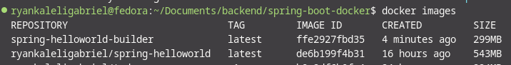

# MULTI-STAGE BUILDS DEMO WITH DOCKER

## RELEVANCE?

> With multi-stage builds,a Docker build uses one base image for compilation, packaging and, unit 
> tests and then a spearate image for the applictaion runtime. As a result, the final image is smaller > in size it doesn't contain any development or debugging tools. By separating the build environment 
> from the final runtime environment, you can significntly reduce the image size and increase the 
> security of your final images

> Multi-stage builds are beneficial for applications with large build dependencies

## DEMO. - This project uses two stages:

> The build stage uses a base image containing build tools needed to compile your application. It 
> includes commands to install build tools, copy source code and execute build commands.

> The final stage uses a msaller base image suitable for running your application. It copies the 
> complied artifacts(a JAR file for example) from thebuild stage. Finally, it defines the runtime 
> configuration (using ENTRYPOINT) for starting your application.

## Use Cases

> For interpreted languages, like Javascript or Ruby or Python, you can build and minify your code in > one stage, and copy the production-ready files to a smaller runtime image. This optimizes your image > for deployment.

> For compiled languages, like Ruby, Go or Java, multi-stage builds let you compile in one stage and 
> copy the compiled binaries into a final runtime image. No need to bundle the enitrre compiler in
> your final image

## Image built without a multi-stage approach(using one base image for building and as a runtime environment) vs Image built with multi-stage build.

